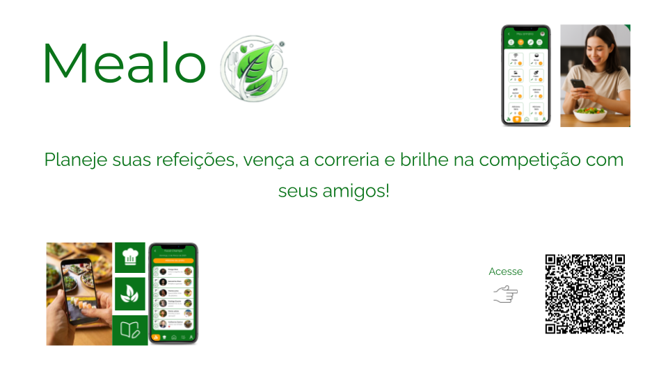
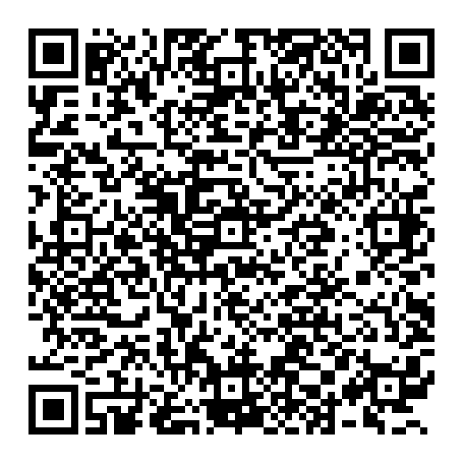
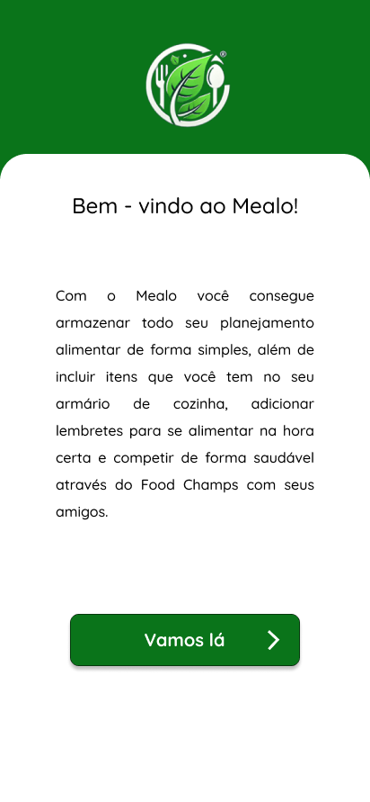
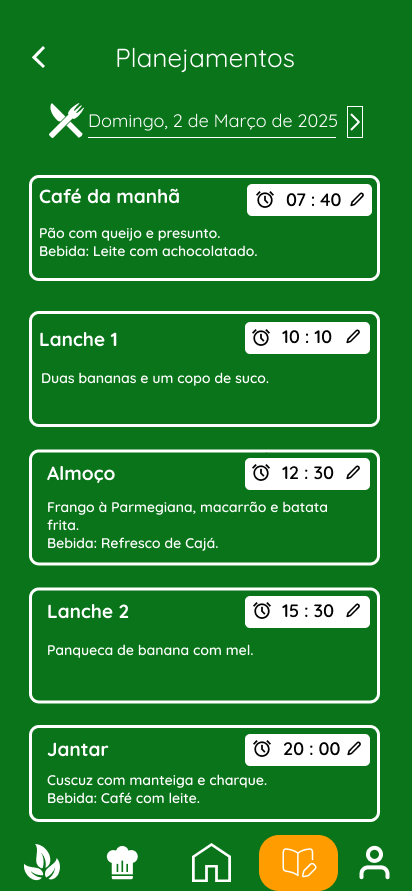

# 🍽️ Mealo – Planeje. Compartilhe. Conquiste.

**Mealo** é um aplicativo desenvolvido com foco em pessoas com rotinas de trabalho intensas, que enfrentam dificuldades para planejar e organizar suas refeições. O app oferece um planejador semanal, gerenciamento de estoque de alimentos, lembretes de horários e uma competição saudável inspirada no estilo Gymrats.

---

## 🎯 Objetivo da Interface
O objetivo deste projeto foi desenvolver a interface interativa de um aplicativo de planejamento alimentar utilizando o **Figma**, focando em usabilidade, organização e engajamento social.

---

## 🛠️ Ferramentas Utilizadas
- [Figma](https://www.figma.com/) para prototipagem
- Google Slides e Marvel para avaliações
- Canva e Photoshop para elementos visuais

---

## 📱 Acesse o protótipo interativo
> 🔗 [Clique aqui para ver o protótipo no Figma]([https://www.figma.com/file/SEU-LINK-AQUI](https://www.figma.com/proto/92SWmx2WDH4faqgmYP2dP7/NexUI-2?node-id=95-68&p=f&t=89vuX94oyd994Uw6-1&scaling=scale-down&content-scaling=fixed&page-id=0%3A1&starting-point-node-id=133%3A82))

---

## 📸 Prints da Interface

### 🏠 Tela Inicial

### 🗓️ Planejador Semanal

---

## 📦 Organização do Projeto

| Seção             | Conteúdo                                      |
|-------------------|-----------------------------------------------|
| `imagens/`        | Banner, prints da interface e QR code         |
| `figma/`          | Link para o protótipo |
| `README.md`       | Explicações, links e documentação do projeto  |

---

## 🚀 Créditos
Projeto desenvolvido por: **[Thiago Bernardo, Rodrigo Neves e Guilherme Barbosa**  
Disciplina: *Concepção de Artefatos Digitais*  
Semestre: 2024.2
